<div class="cover">

# AXIOM V2

**AI-powered real estate platform for the Egyptian market**

Faculty of Computer Science and Information Technology

Submitted by:

- Baher Mohamed
- Shrouk Saber
- Youssef Mohamed
- Abanoub Attia
- Ehab Ashraf
- Abdelrahman Wael
- Fady Alber

A dissertation submitted in partial fulfillment of the requirements for the degree of Bachelor of Computer Science and Information Technology.

Supervised by: **Dr. Bahaa Mohamed**

Egypt 2026

</div>

# Committee Report

We certify that we have read this graduation project report and examined its content. In our opinion, the document is adequate as a project report for **AXIOM V2**.

# Intellectual Property Right Declaration

This work was prepared as a graduation project under university supervision. The source code and report content describe the AXIOM V2 platform and may be reused for academic extension, product development, or organizational adoption only with the required permissions.

# Anti-Plagiarism Declaration

This report was regenerated from the current AXIOM V2 source code, official report template, and old report metadata. Diagrams and requirements were derived from implemented code, SQL migrations, API routes, tests, and configuration files.

<section class="front-page">

# Table of Contents

<ol class="toc-grid">
<li>Acknowledgement</li>
<li>Abstract</li>
<li>List of Figures</li>
<li>List of Tables</li>
<li>List of Abbreviations and Acronyms</li>
<li>Chapter 1: Introduction</li>
<li>Chapter 2: Background and Previous Work</li>
<li>Chapter 3: Planning and Analysis</li>
<li>Chapter 4: Design</li>
<li>Chapter 5: Implementation</li>
<li>Chapter 6: Testing</li>
</ol>

</section>

# List of Figures

1. Figure 4.1: Updated ERD generated from SQL migrations.
2. Figure 4.2: Backend class diagram.
3. Figure 4.3: Primary use-case diagram.
4. Figure 4.4: User activity flow.
5. Figure 4.5: Admin activity flow.
6. Figure 4.6: User enquiry and booking sequence.
7. Figure 4.7: Admin listing verification sequence.
8. Figure 4.8: Listing lifecycle state diagram.
9. Figure 5.1: Home page screenshot.
10. Figure 5.2: Find homes screenshot.
11. Figure 5.3: Admin login screenshot.

# List of Tables

1. Requirements evidence table.
2. Functional endpoint summary.
3. Non-functional requirements table.
4. Entity mapping table.

# List of Abbreviations and Acronyms

| Term | Meaning |
|---|---|
| AI | Artificial Intelligence |
| API | Application Programming Interface |
| ERD | Entity Relationship Diagram |
| JWT | JSON Web Token |
| RAG | Retrieval-Augmented Generation |
| RLS | Row Level Security |
| SSE | Server-Sent Events |

# Acknowledgement

The team thanks the project supervisor, faculty members, and reviewers who guided the development of AXIOM V2. Their feedback shaped the transition from a conventional broker website into an AI-assisted real estate platform for the Egyptian market.

# Abstract

AXIOM V2 is an AI-powered real estate platform for Egypt. The application combines a Next.js 16 frontend, a FastAPI backend, Supabase authentication and PostgreSQL storage, pgvector semantic search, local Ollama models, and Stripe payment/subscription flows. The system supports property discovery, listing management, shared housing applications, WhatsApp lead capture, AI search, chatbot assistance, recommendations, fraud checks, admin moderation, and subscription-based owner limits.

# Chapter 1: Introduction

## 1.1 Overview

AXIOM V2 modernizes real estate discovery by combining searchable property inventory, owner dashboards, admin moderation, AI-assisted discovery, and lead generation. The platform uses a single role model (`user` and `admin`) and treats all property categories through a unified listing model: rent, sale, and shared housing.

## 1.2 Motivation

The Egyptian real estate market requires fast discovery, trusted listings, direct contact paths, and flexible housing options. AXIOM addresses these needs by replacing static broker-style browsing with AI search, verified seller badges, WhatsApp enquiry capture, shared-housing compatibility, and structured admin approval workflows.

## 1.3 Objective

The objective is to provide a production-ready web platform where users can search, compare, save, enquire about, and book properties, while owners and admins manage listing quality and platform operations.

## 1.4 Aim

The project aims to improve property discovery accuracy, reduce listing fraud, simplify owner workflows, and make the platform extensible for AI features, subscriptions, payments, and future deployment.

## 1.5 Scope

The implemented scope includes public property pages, search pages, shared housing, user authentication, dashboard management, admin CRUD and moderation, AI search/chat/recommendations, subscriptions, bookings, WhatsApp lead capture, universities, agencies, projects, and blog content. Frontend routes include: `/`, `/about`, `/admin`, `/admin/dashboard`, `/admin/login`, `/agencies`, `/agencies/[slug]`, `/auth/callback`, `/blog`, `/blog/[slug]`, `/booking/[id]`, `/dashboard`, `/find-homes`, `/forgot-password`, `/likes`, `/login`, `/pricing`, `/project/[id]`, `/property/[id]`, `/reset-password`, `/shared-housing`, `/shared-housing/[id]`, `/signup`, `/universities`, `/universities/[slug]`.

## 1.6 General Constraints

The backend depends on Supabase credentials, JWT secrets, Ollama model availability, Stripe keys, and a configured frontend URL. The frontend depends on Supabase public credentials and the backend API URL. Local AI is intentionally configured through Ollama rather than an external AI API.

## 1.7 Organization of the Dissertation

Chapter 2 reviews background and previous work. Chapter 3 presents planning and analysis. Chapter 4 documents database and software design with regenerated diagrams. Chapter 5 describes implementation and UI results. Chapter 6 summarizes verification through unit and integration tests.

# Chapter 2 Background and Previous Work

## 2.1 Background

The earlier Broker Website report described a traditional property brokerage system. AXIOM V2 extends that concept into a modern full-stack product. The current repository contains a FastAPI service layer, Supabase-backed data access, a Next.js application, server/client state management, and AI modules for search, recommendation, compatibility, validation, and content generation.

## 2.2 Previous Work

The old report is used only as a metadata and narrative reference. Its diagrams are obsolete because the current architecture no longer follows the old PHP/MySQL style. Current evidence comes from `AXIOM-V2` source files: `README.md`, `docs/API_REFERENCE.md`, `docs/ROADMAP.md`, backend routers, frontend routes, SQL migrations, and tests.

# Chapter 3 Planning and Analysis

## 3.1 Planning

The implementation is organized into frontend, backend, database, AI, payment, and deployment layers. Source inspection found 97 backend API routes, 20 database tables, and 54 backend Python classes/schemas/services.

## 3.1.1 Feasibility Study and Estimated Cost

The project is technically feasible with open-source and managed services. Development uses Next.js, FastAPI, Supabase, PostgreSQL, Ollama, and Stripe. Operational cost is driven by Supabase hosting, deployment infrastructure, Stripe processing fees, and the machine running Ollama embeddings/chat.

## 3.1.2 Gantt Chart

The roadmap shows phased delivery: core pages and auth, Supabase wiring, AI features, admin CRUD, WhatsApp leads, payment/subscription features, partner universities, deployment infrastructure, and final QA.

## 3.2 Analysis and Limitations of Existing System

The earlier broker system relied on more static listing flows and outdated diagrams. It did not reflect the current unified owner model, shared-housing category, AI search, subscription quotas, Stripe webhook synchronization, or WhatsApp lead capture.

## 3.3 Need for New System

The new system is needed to centralize listings, reduce manual brokerage friction, improve trust through moderation and seller verification, support AI-assisted discovery, and align with modern frontend/backend deployment practices.

## 3.4 Analysis of New System

AXIOM V2 separates concerns across a typed Next.js UI, FastAPI routers, Supabase data storage, AI service modules, and payment/subscription services. The API surface is documented in `docs/API_REFERENCE.md` and implemented through FastAPI routers.

## 3.4.1 User Requirements

| Code | Requirement | Evidence |
|---|---|---|
| FR-01 | Users can register, log in, and update their profile. | Implemented |
| FR-02 | Visitors can search and view listings. | Implemented |
| FR-03 | Owners can create, update, and delete listings. | Implemented |
| FR-04 | Users can favorite listings and review them later. | Implemented |
| FR-05 | Users can submit WhatsApp leads for property enquiries. | Implemented |
| FR-06 | Shared-housing users can submit applications. | Implemented |
| FR-07 | Renters can create and manage booking payments. | Implemented |
| FR-08 | AI search, chatbot, recommendations, descriptions, validation, and compatibility are available. | Implemented |
| FR-09 | Admins can moderate listings and verify users. | Implemented |
| FR-10 | Owners can manage subscription plans and listing caps. | Implemented |

## 3.4.2 System Requirements

The system requires Python 3.11+, FastAPI dependencies, Node.js, Next.js 16, Supabase project configuration, PostgreSQL schema migrations, local or hosted Ollama, and Stripe credentials for payment/subscription flows.

## 3.4.3 Domain Requirements

The real estate domain model includes users/profiles, listings, agencies, projects, neighborhoods, favorites, applications, viewings, leads, bookings, payments, subscriptions, notifications, universities, and blog content. Listing status and category values are encoded as SQL enums and frontend/API TypeScript types.

## 3.4.4 Functional Requirements

| Area | Implemented endpoints | Representative paths | Access model |
|---|---:|---|---|
| admin | 34 | `POST /api/admin/auth/login`, `GET /api/admin/stats`, `GET /api/admin/listings` | Admin |
| agencies | 7 | `GET /api/agencies`, `GET /api/agencies/{slug}/projects`, `GET /api/agencies/{slug}/listings` | JWT user, Public |
| ai | 7 | `POST /api/ai/search`, `POST /api/ai/chat`, `GET /api/ai/recommendations` | JWT user, Public |
| applications | 3 | `POST /api/applications`, `GET /api/applications/my`, `PUT /api/applications/{application_id}` | JWT user |
| auth | 6 | `POST /api/auth/signup`, `POST /api/auth/login`, `GET /api/auth/me` | JWT user, Public |
| blog | 3 | `GET /api/blog`, `GET /api/blog/{slug}/related`, `GET /api/blog/{slug}` | Public |
| bookings | 10 | `GET /api/bookings/fees`, `POST /api/bookings/payment-intent`, `POST /api/bookings/sync-payment` | JWT user, Public |
| dashboard | 1 | `GET /api/dashboard/me` | JWT user |
| leads | 2 | `POST /api/leads`, `GET /api/admin/leads` | JWT user, Public |
| listings | 9 | `GET /api/listings`, `GET /api/listings/favorites`, `GET /api/listings/{listing_id}` | JWT user, Public |
| notifications | 3 | `GET /api/notifications`, `PUT /api/notifications/read-all`, `PUT /api/notifications/{notification_id}/read` | JWT user |
| projects | 1 | `GET /api/projects/{project_id}` | Public |
| stripe_webhooks | 1 | `POST /api/stripe/webhook` | Public |
| subscriptions | 4 | `GET /api/subscriptions/me`, `POST /api/subscriptions/start-trial`, `POST /api/subscriptions/checkout` | JWT user |
| universities | 3 | `GET /api/universities`, `GET /api/universities/{slug}/listings`, `GET /api/universities/{slug}` | Public |
| uploads | 1 | `POST /api/uploads/signed-url` | JWT user |
| viewings | 2 | `POST /api/viewings`, `PUT /api/viewings/{viewing_id}` | JWT user |

## 3.4.5 Non-Functional Requirements

| Code | Requirement | Evidence |
|---|---|---|
| NR-01 | Authentication uses Supabase JWTs on protected API endpoints. | Implemented |
| NR-02 | Security headers protect content type, frame embedding, XSS mode, and referrer policy. | Implemented |
| NR-03 | AI and auth endpoints are rate-limited to reduce abuse and model cost. | Implemented |
| NR-04 | CORS is restricted to configured frontend origins outside development. | Implemented |
| NR-05 | Semantic search uses pgvector embeddings. | Implemented |
| NR-06 | Payment and subscription flows use Stripe configuration and webhooks. | Implemented |
| NR-07 | Ollama model configuration is explicit and environment-driven. | Implemented |

## 3.5 Advantages of New System

AXIOM V2 provides AI-assisted search and recommendations, a unified listing model, admin moderation, verified seller badges, direct WhatsApp enquiry capture, shared-housing compatibility, owner subscriptions, Stripe booking deposits, and a dashboard-oriented user experience.

## 3.6 User Characteristics

Users include property seekers, renters, shared-housing applicants, property owners, agency/developer representatives, and platform admins. The implementation deliberately avoids separate seeker/broker roles and uses a unified `user` role with optional verified seller state.

# Chapter 4: Design

## 4.1 Design and Implementation Constraints

The project uses a Next.js App Router frontend and FastAPI backend. Auth depends on Supabase JWTs. Database access uses Supabase/PostgreSQL with Row Level Security policies. AI depends on Ollama and pgvector. Payments and subscriptions depend on Stripe webhooks and configured price IDs.

## 4.2 Assumptions and Dependencies

The backend assumes valid Supabase keys, JWT secrets, and service role access for server-side operations. The frontend assumes a configured API URL and Supabase public key. AI features assume `axiom-llm` and `nomic-embed-text` are available in Ollama.

## 4.3 Risks and Risk Management

Important risks include stale environment variables, Stripe webhook misconfiguration, Supabase schema drift, AI service downtime, and admin moderation gaps. Mitigations include environment validation, webhook tests, SQL migrations, fallback AI error responses, rate limiting, and admin approval workflows.

## 4.4 Design of Database ERD

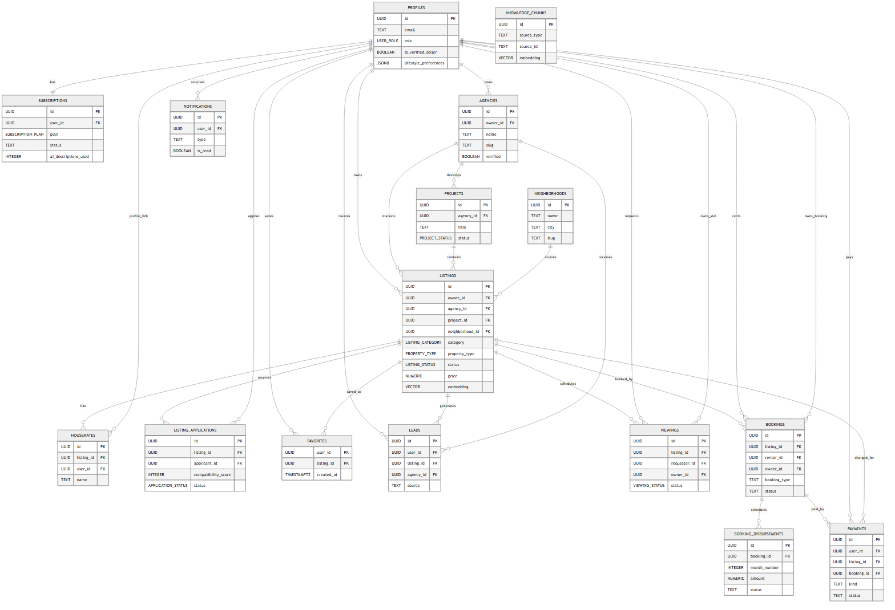

<div class="caption">Figure 4.1: Updated ERD generated from SQL migrations.</div>

## 4.1.1 Entity Relationship Diagram

The ERD is generated from `CREATE TABLE` definitions and inline `REFERENCES` constraints found in `docs/schema` and `backend/sql`.

## 4.1.2 Mapping of Entity Relationship Diagram

| Table | Key attributes | Relationships |
|---|---|---|
| `neighborhoods` | `id`, `name`, `name_ar`, `city`, `slug`, `created_at` | none |
| `profiles` | `id`, `email`, `full_name`, `avatar_url`, `phone`, `bio`, `role`, `is_verified_seller` | `id` -> `users`, `lifestyle_preferences` -> `jsonb` |
| `agencies` | `id`, `owner_id`, `name`, `slug`, `description`, `logo_url`, `banner_url`, `website` | `owner_id` -> `profiles` |
| `projects` | `id`, `agency_id`, `title`, `slug`, `description`, `image_url`, `starting_price`, `units_total` | `agency_id` -> `agencies` |
| `listings` | `id`, `owner_id`, `agency_id`, `project_id`, `title`, `description`, `category`, `property_type` | `owner_id` -> `profiles`, `agency_id` -> `agencies`, `project_id` -> `projects`, `neighborhood_id` -> `neighborhoods`, `lifestyle_preferences` -> `jsonb` |
| `housemates` | `id`, `listing_id`, `user_id`, `name`, `age`, `occupation`, `avatar_url`, `tags` | `listing_id` -> `listings`, `user_id` -> `profiles` |
| `listing_applications` | `id`, `listing_id`, `applicant_id`, `lifestyle_data`, `compatibility_score`, `status`, `message`, `created_at` | `listing_id` -> `listings`, `applicant_id` -> `profiles` |
| `favorites` | `user_id`, `listing_id`, `created_at` | `user_id` -> `profiles`, `listing_id` -> `listings` |
| `conversations` | `id`, `user_a_id`, `user_b_id`, `listing_id`, `last_message_at`, `created_at` | `user_a_id` -> `profiles`, `user_b_id` -> `profiles`, `listing_id` -> `listings` |
| `messages` | `id`, `conversation_id`, `sender_id`, `text`, `attachment_url`, `attachment_name`, `attachment_size`, `created_at` | `conversation_id` -> `conversations`, `sender_id` -> `profiles` |
| `notifications` | `id`, `user_id`, `type`, `title`, `body`, `metadata`, `is_read`, `created_at` | `user_id` -> `profiles` |
| `blog_posts` | `id`, `author_id`, `title`, `slug`, `lead`, `category`, `image_url`, `content` | `author_id` -> `profiles` |
| `viewings` | `id`, `listing_id`, `requester_id`, `owner_id`, `scheduled_at`, `status`, `notes`, `created_at` | `listing_id` -> `listings`, `requester_id` -> `profiles`, `owner_id` -> `profiles` |
| `blocked_users` | `id`, `blocker_id`, `blocked_id`, `reason`, `created_at` | `blocker_id` -> `profiles`, `blocked_id` -> `profiles` |
| `knowledge_chunks` | `id`, `source_type`, `source_id`, `chunk_text`, `embedding`, `metadata`, `created_at`, `updated_at` | none |
| `leads` | `id`, `user_id`, `listing_id`, `agency_id`, `contact_name`, `contact_phone`, `source`, `is_billable` | `user_id` -> `profiles`, `listing_id` -> `listings`, `agency_id` -> `agencies` |
| `bookings` | `id`, `listing_id`, `renter_id`, `owner_id`, `booking_type`, `start_date`, `end_date`, `duration_months` | `listing_id` -> `listings`, `renter_id` -> `profiles`, `owner_id` -> `profiles` |
| `booking_disbursements` | `id`, `booking_id`, `month_number`, `amount`, `scheduled_date`, `status`, `owner_requested_at`, `released_at` | `booking_id` -> `bookings` |
| `payments` | `id`, `user_id`, `listing_id`, `booking_id`, `kind`, `amount`, `currency`, `stripe_payment_intent_id` | `user_id` -> `profiles`, `listing_id` -> `listings`, `booking_id` -> `bookings` |
| `subscriptions` | `id`, `user_id`, `plan`, `status`, `stripe_customer_id`, `stripe_subscription_id`, `trial_used`, `trial_ends_at` | `user_id` -> `profiles` |

Enums:

- `user_role`: user, admin
- `listing_category`: for_rent, for_sale, shared_housing
- `property_type`: apartment, villa, studio, duplex, penthouse, commercial, room, chalet, townhouse, twin_house, land, whole_building, office
- `listing_status`: active, pending, rejected, sold, rented
- `application_status`: pending, approved, rejected
- `project_status`: upcoming, in_progress, completed
- `viewing_status`: pending, confirmed, cancelled, completed
- `subscription_plan`: free, trial, basic, pro, agency

## 4.5 Class Diagram

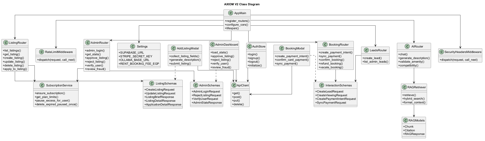

<div class="caption">Figure 4.2: Class diagram generated from backend Python AST classes and schemas.</div>

## 4.6 Use Case Diagram

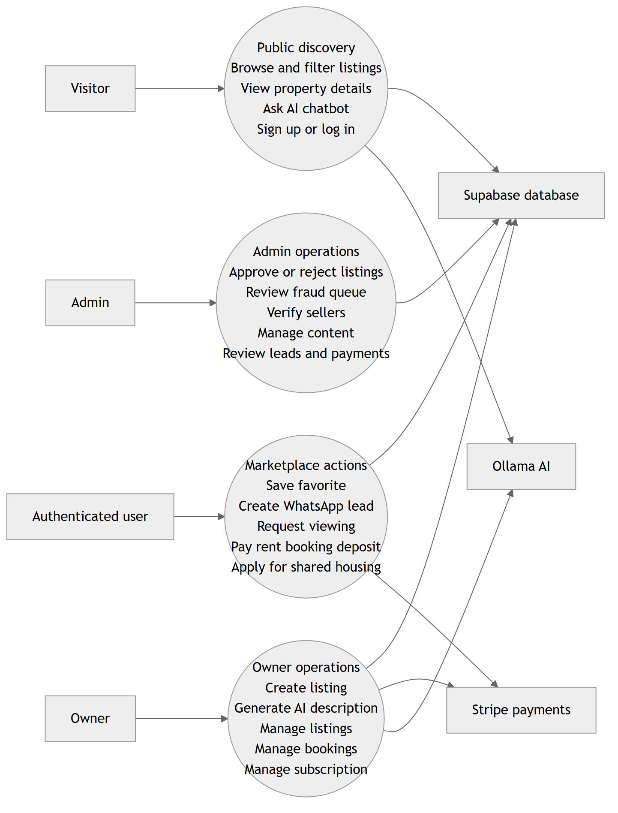

<div class="caption">Figure 4.3: Primary use-case diagram generated from FastAPI route coverage.</div>

## 4.3.1 Primary Use-case Diagram

The primary use cases are search, property detail viewing, favourites, WhatsApp enquiries, booking, shared-housing applications, owner listing management, subscriptions, admin moderation, user verification, and lead review.

## 4.3.2 Use-case Scenarios

Typical scenarios include: a visitor searches listings with structured filters or AI; a signed-in user saves a property or opens WhatsApp; an owner creates a listing that enters pending review; an admin approves or rejects it; and a renter completes a booking deposit.

## 4.7 Activity Diagram

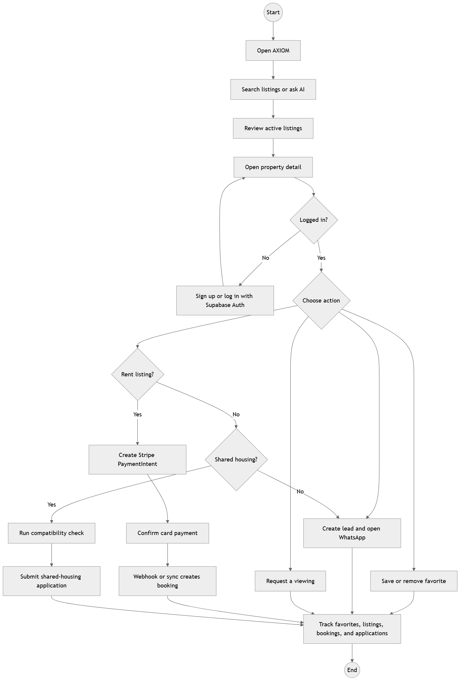

<div class="caption">Figure 4.4: User activity flow generated from frontend routes and backend capabilities.</div>

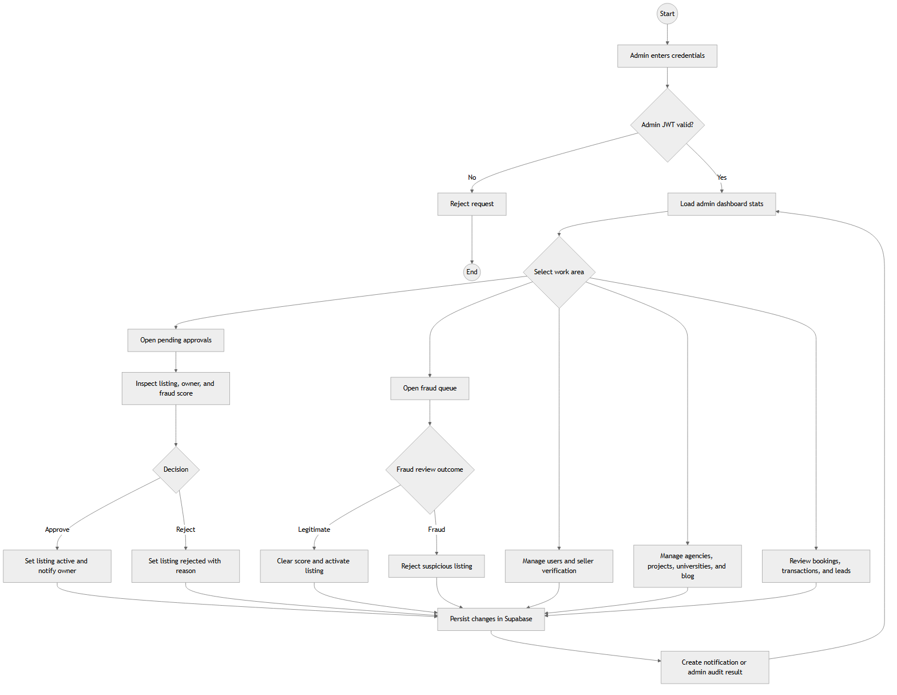

<div class="caption">Figure 4.5: Admin activity flow generated from admin dashboard routes and endpoints.</div>

## 4.8 Sequence Diagram

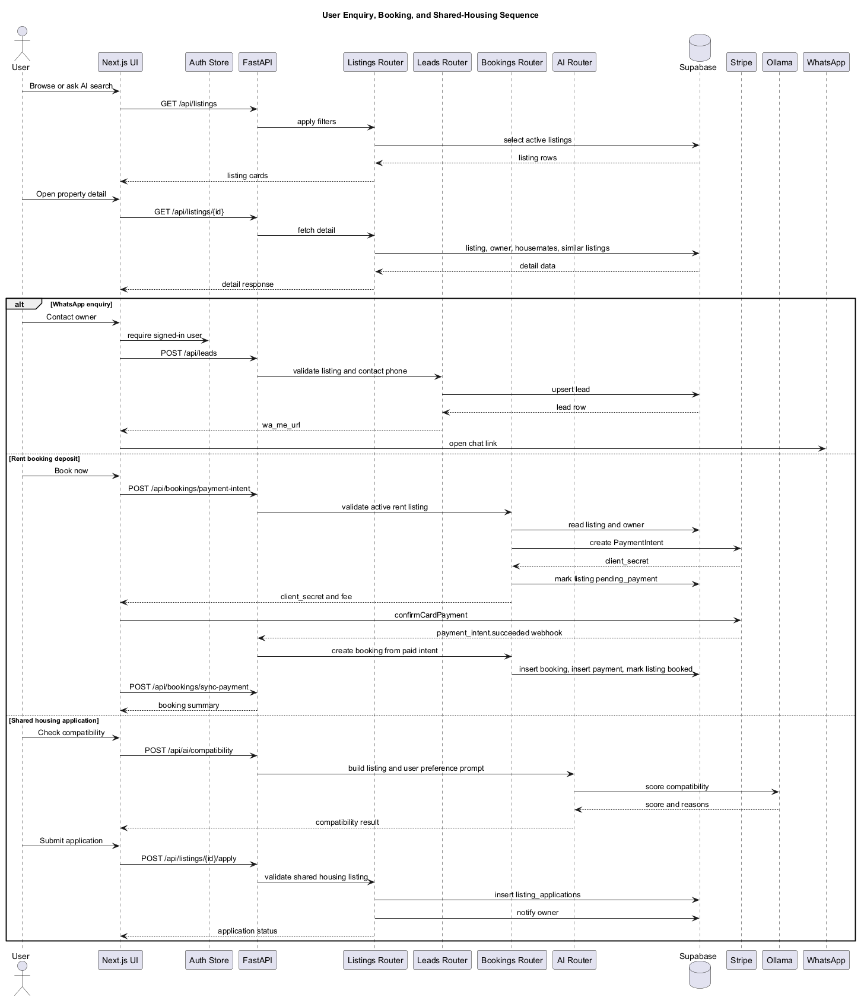

<div class="caption">Figure 4.6: User enquiry and booking sequence generated from controller/router responsibilities.</div>

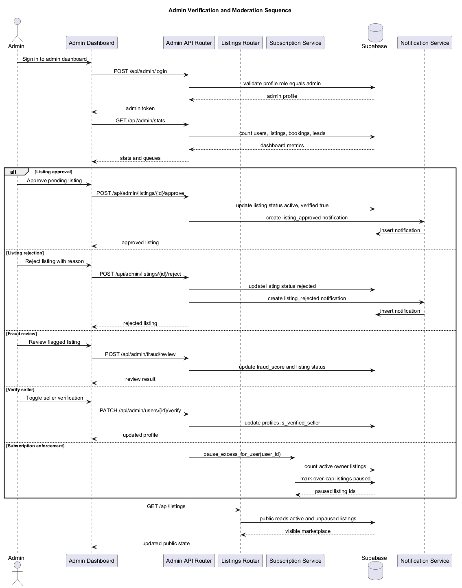

<div class="caption">Figure 4.7: Admin listing verification sequence generated from admin routes.</div>

## 4.9 State Diagram

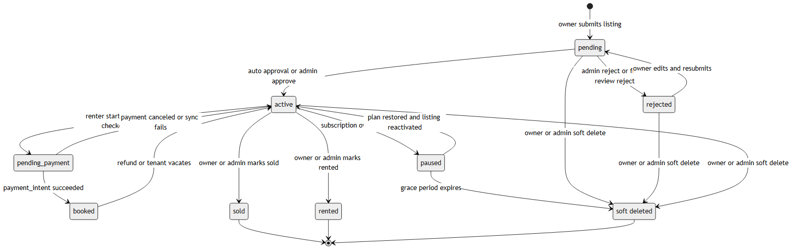

<div class="caption">Figure 4.8: State diagram for the implemented listing review lifecycle. AXIOM V2 has no separate Inquiry entity; enquiries are implemented as WhatsApp leads and viewings.</div>

# Chapter 5: Implementation

## 5.1 Software Architecture

AXIOM V2 is implemented as a two-application system. The frontend is a Next.js 16 application with React 19, TypeScript, Tailwind CSS, shadcn-style UI components, Zustand auth state, and TanStack Query. The backend is a FastAPI application with routers for auth, listings, dashboard, notifications, agencies, viewings, blog, admin, AI, uploads, applications, bookings, Stripe webhooks, projects, leads, universities, and subscriptions.

Main frontend dependencies include: `@stripe/react-stripe-js`, `@stripe/stripe-js`, `@supabase/supabase-js`, `@tanstack/react-query`, `@tiptap/pm`, `@tiptap/react`, `@tiptap/starter-kit`, `class-variance-authority`, `clsx`, `date-fns`, `framer-motion`, `lucide-react`, `next`, `radix-ui`, `react`, `react-dom`, `react-hook-form`, `sonner`, `tailwind-merge`, `zod`, `zustand`.

Backend requirements include: `fastapi>=0.115.0`, `uvicorn[standard]>=0.30.0`, `pydantic[email]>=2.0.0`, `pydantic-settings>=2.0.0`, `supabase>=2.9.0`, `python-jose[cryptography]>=3.3.0`, `PyJWT>=2.8.0`, `httpx>=0.27.0`, `python-multipart>=0.0.9`, `python-dotenv>=1.0.0`, `twilio>=9.0.0`, `python-dateutil>=2.8.0`, `stripe>=11.0.0`.

The README summarizes the stack as: # AXIOM V2 AI-powered real estate platform for the Egyptian market. **Stack:** Next.js 16 · FastAPI · Supabase · Ollama · TypeScript · Python 3.11 --- ## Quick Start ### Frontend ```bash cd frontend npm install npm run dev # http://localhost:3000 ``` Create `frontend/.env.local`: ```env NEXT_PUBLIC_SUPABASE_URL=https://your-project.supabase.co NEXT_PUBLIC_SUPABASE_ANON_KEY=your-anon-key NEXT_PUBLIC_API_URL=http://localhost:8000 ``` ### Backend ```bash cd backend python -m venv venv venv\Scripts\activate pip install -r requirements.txt uvicorn app.main:app --reload --port 8000 # http://localhost:8000 ``` ### AI (Ollama) ```bash ollama pull nomic-embed-text ollama create axiom-llm -f path/to/Modelfile ``` ---

## 5.2 User Interface

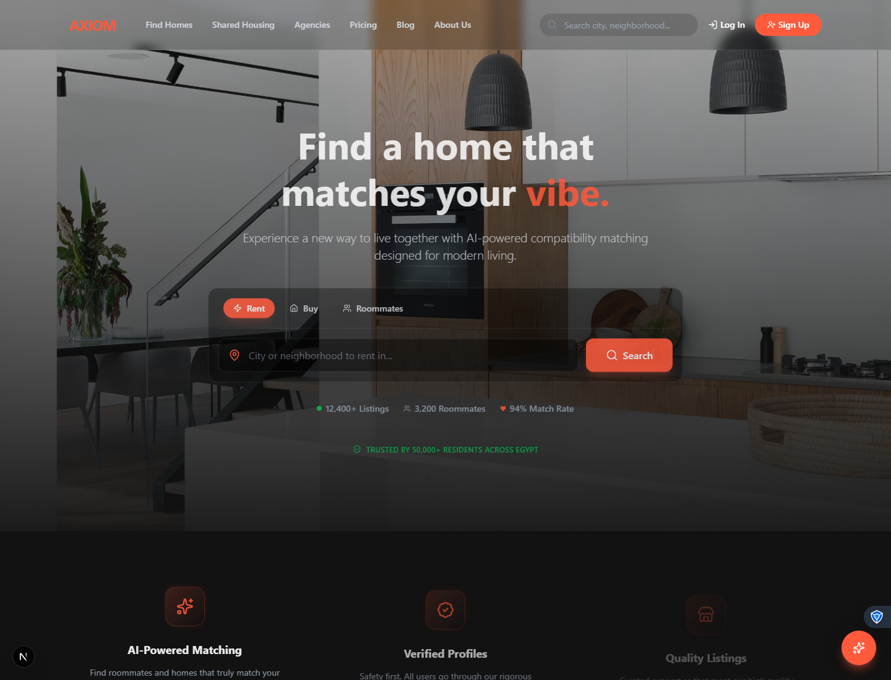

<div class="caption">Figure 5.x: Home page screenshot captured from the running frontend.</div>

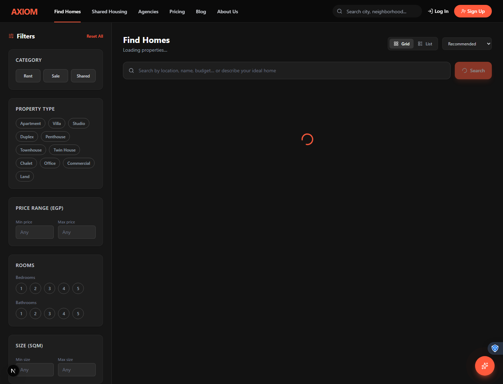

<div class="caption">Figure 5.x: Find homes search screenshot captured from the running frontend.</div>

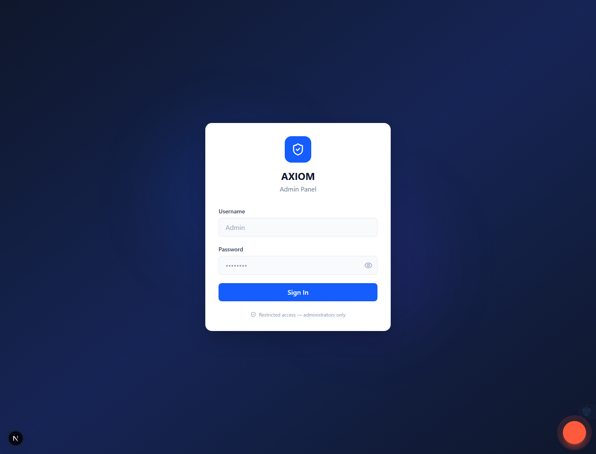

<div class="caption">Figure 5.x: Admin login screenshot captured from the running frontend.</div>

<div class="note">Protected dashboard and pricing states are described in text instead of embedded when the local screenshot run is unauthenticated or the API is unavailable.</div>

## 5.3 Results and Discussion

The resulting platform replaces the old broker report architecture with a code-backed system that supports live public pages, admin management, AI features, direct Supabase queries, Stripe payments, subscriptions, WhatsApp leads, and deployment infrastructure. The roadmap records backend tests as green and identifies remaining launch tasks around environment setup, deployment, and final payment QA.

# Chapter 6: Testing

## 6.1 Unit Testing

Backend tests are implemented with pytest under `backend/tests`. The test suite covers auth, listings, dashboard, AI helpers, applications, bookings, admin behavior, notifications, uploads, subscriptions, leads, agencies, projects, blog, and amenity validation.

Current pytest status: **issues found**.

Captured pytest detail:

```
6 failed, 117 passed, 1 warning in 17.65s
```

## 6.2 Integration Testing

Integration-oriented checks include FastAPI route tests, Supabase client mocks, Stripe booking/subscription behavior, admin listing moderation, API error handling, and frontend TypeScript compilation.

TypeScript status: **passed**.

Captured TypeScript detail:

```
npx tsc --noEmit completed with no output.
```

The generated requirements tables were cross-checked against actual routers and configuration flags. Table names and attributes in this report were generated from SQL migrations to keep IDs, table names, and relationships synchronized with the ERD.
